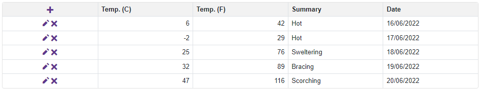

<!-- default badges list -->
[](https://supportcenter.devexpress.com/ticket/details/T807225)
[](https://docs.devexpress.com/GeneralInformation/403183)
<!-- default badges end -->

# Blazor Data Grid - Use icons instead of default command buttons

Currently, our DataGrid for Blazor does not support any API to customize command button appearance. However, you can use templates instead.



You can add content to the command column's [CellTemplate](https://docs.devexpress.com/Blazor/DevExpress.Blazor.DxDataGridCommandColumn.CellTemplate) or [HeaderCellTemplate](https://docs.devexpress.com/Blazor/DevExpress.Blazor.DxDataGridCommandColumn.HeaderCellTemplate) template, for example, <button> or <a> HTML elements.

Handle the corresponding event and use the [StartRowEdit](https://docs.devexpress.com/Blazor/DevExpress.Blazor.DxDataGrid-1.StartRowEdit(System.Object)) method to implement the necessary functionality. Send the following input parameters:

* A *null* object if you want to create a new record
* The existing object if you edit a record

Use the *context* object to obtain the current row object in the column's [CellTemplate](https://docs.devexpress.com/Blazor/DevExpress.Blazor.DxDataGridCommandColumn.CellTemplate) template:

```razor
<CellTemplate>
    <a class="oi oi-pencil" @onclick="@(() => MyGrid.StartRowEdit(context))" href="javascript:void(0);"></a>
    @* ... *@
</CellTemplate>
```

<!-- default file list -->
## Files to look at

* [Index.razor](./CS/CommandButtonsWithIcons/Pages/Index.razor)
<!-- default file list end -->

## Documentation

- [CellTemplate](https://docs.devexpress.com/Blazor/DevExpress.Blazor.DxDataGridCommandColumn.CellTemplate)
- [HeaderCellTemplate](https://docs.devexpress.com/Blazor/DevExpress.Blazor.DxDataGridCommandColumn.HeaderCellTemplate)
- [EditTemplate](https://docs.devexpress.com/Blazor/DevExpress.Blazor.DxDataGridColumn.EditTemplate)
- [DisplayTemplate](https://docs.devexpress.com/Blazor/DevExpress.Blazor.DxDataGridColumn.DisplayTemplate)

## More Examples

- [DataGrid - Edit Data On a Separate Page](https://github.com/DevExpress-Examples/blazor-DxDataGrid-Separate-Edit-Form)
