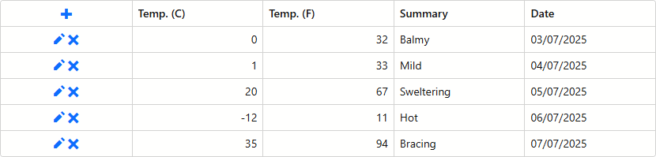

<!-- default badges list -->

[](https://supportcenter.devexpress.com/ticket/details/T807225)
[](https://docs.devexpress.com/GeneralInformation/403183)
[](#does-this-example-address-your-development-requirementsobjectives)
<!-- default badges end -->

# Blazor Grid - Use Custom Icons As Command Buttons

A [command column](https://docs.devexpress.com/Blazor/DevExpress.Blazor.DxGridCommandColumn) displays predefined **New**, **Edit**, and **Delete** command buttons (as icons) for data rows in display mode. In `EditRow` and `EditCell` edit modes, this column displays **Save** and **Cancel** buttons for the edited row. You can use [HeaderTemplate](https://docs.devexpress.com/Blazor/DevExpress.Blazor.DxGridCommandColumn.HeaderTemplate), [CellDisplayTemplate](https://docs.devexpress.com/Blazor/DevExpress.Blazor.DxGridCommandColumn.CellDisplayTemplate), or [CellEditTemplate](https://docs.devexpress.com/Blazor/DevExpress.Blazor.DxGridCommandColumn.CellEditTemplate) to change command button appearance within the DevExpress Blazor Grid.



Handle the corresponding event and use [StartEditNewRowAsync](https://docs.devexpress.com/Blazor/DevExpress.Blazor.DxGrid.StartEditNewRowAsync), [StartEditDataItemAsync](https://docs.devexpress.com/Blazor/DevExpress.Blazor.DxGrid.StartEditDataItemAsync(System.Object)) and [ShowDataItemDeleteConfirmation](https://docs.devexpress.com/Blazor/DevExpress.Blazor.DxGrid.ShowDataItemDeleteConfirmation(System.Object)) methods to implement required functionality. Ensure to pass one of the following input parameters:

* A *null* object if you want to create a new record
* An existing object if you edit or delete a record

Use the *context* object to obtain the current row object in the column [CellDisplayTemplate](https://docs.devexpress.com/Blazor/DevExpress.Blazor.DxGridCommandColumn.CellDisplayTemplate):

```Razor
<CellDisplayTemplate>
    <a class="oi oi-pencil link-decoration" @onclick="@(() => MyGrid.StartEditRowAsync(context.VisibleIndex))" href="javascript:void(0);"></a>
    <a class="oi oi-x link-decoration" @onclick="@(() => MyGrid.ShowDataItemDeleteConfirmation(context.DataItem))" href="javascript:void(0);"></a>
</CellDisplayTemplate>
```

## Files to Review

* [Index.razor](./CS/CommandButtonsWithIcons/Pages/Index.razor)

## Documentation

* [Blazor Grid - Command Column](https://docs.devexpress.com/Blazor/DevExpress.Blazor.DxGridCommandColumn)

## More Examples

* [Grid for Blazor - Create a custom record deletion confirmation dialog](https://github.com/DevExpress-Examples/blazor-grid-show-custom-confirmation-dialog)
* [Blazor Grid - Use an External Popup as an Edit Form](https://github.com/DevExpress-Examples/blazor-grid-popup-edit-form-customization)

<!-- feedback -->
## Does this example address your development requirements/objectives?

[](https://www.devexpress.com/support/examples/survey.xml?utm_source=github&utm_campaign=blazor-grid-command-buttons-with-icons&~~~was_helpful=yes) [](https://www.devexpress.com/support/examples/survey.xml?utm_source=github&utm_campaign=blazor-grid-command-buttons-with-icons&~~~was_helpful=no)

(you will be redirected to DevExpress.com to submit your response)
<!-- feedback end -->

